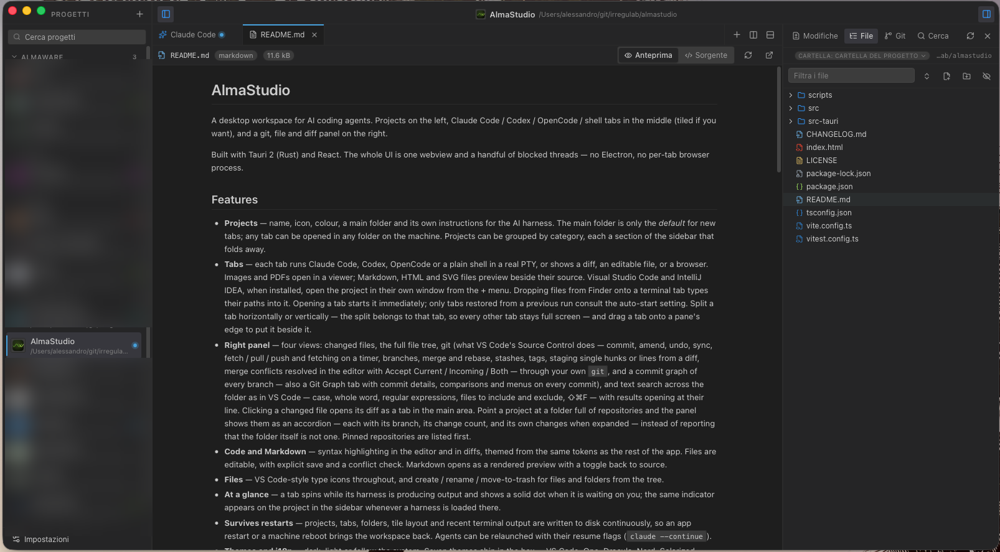
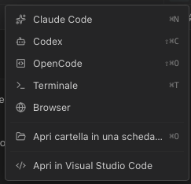

# AlmaStudio

A desktop workspace for AI coding agents. Projects on the left, Claude Code /
Codex / OpenCode / shell tabs in the middle (tiled if you want), and a git,
file and diff panel on the right.

Built with Tauri 2 (Rust) and React. The whole UI is one webview and a handful
of blocked threads — no Electron, no per-tab browser process.

## Screenshots

<p align="center">
  
</p>

<p align="center">
  
</p>

## Features

- **Projects** — name, icon, colour, a main folder and its own instructions for
  the AI harness. The main folder is only the *default* for new tabs; any tab
  can be opened in any folder on the machine. Projects can be grouped by
  category, each a section of the sidebar that folds away.
- **Tabs** — each tab runs Claude Code, Codex, OpenCode or a plain shell in a
  real PTY, or shows a diff, an editable file, or a browser. Images and PDFs
  open in a viewer; Markdown, HTML and SVG files preview beside their source.
  Visual Studio Code and IntelliJ IDEA, when installed, open the project in
  their own window from the + menu.
  Dropping files
  from Finder onto a terminal tab types their paths into it. Opening a tab starts it immediately; only tabs
  restored from a previous run consult the auto-start setting. Split a tab
  horizontally or vertically — the split belongs to that tab, so every other
  tab stays full screen — and drag a tab onto a pane's edge to put it beside it.
- **Right panel** — four views: changed files, the full file tree, git
  (what VS Code's Source Control does — commit, amend, undo, sync, fetch /
  pull / push and fetching on a timer, branches, merge and rebase, stashes,
  tags, staging single hunks or lines from a diff, merge conflicts resolved
  in the editor with Accept Current / Incoming / Both — through your own
  `git`, and a commit graph of every branch — also a Git Graph tab with
  commit details, comparisons and menus on every commit), and text search across
  the folder as in VS Code — case, whole word, regular expressions, files to
  include and exclude, ⇧⌘F — with results opening at their line. Clicking a changed file
  opens its diff as a tab in the main area. Point a project at a folder full of
  repositories and the panel shows them as an accordion — each with its branch,
  its change count, and its own changes when expanded — instead of reporting
  that the folder itself is not one. Pinned repositories are listed first.
- **Code and Markdown** — syntax highlighting in the editor and in diffs,
  themed from the same tokens as the rest of the app. Files are editable, with
  explicit save and a conflict check. Markdown opens as a rendered preview with
  a toggle back to source.
- **Files** — VS Code-style type icons throughout, and create / rename /
  move-to-trash for files and folders from the tree.
- **At a glance** — a tab spins while its harness is producing output and shows
  a solid dot when it is waiting on you; the same indicator appears on the
  project in the sidebar whenever a harness is loaded there.
- **Survives restarts** — projects, tabs, folders, tile layout and recent
  terminal output are written to disk continuously, so an app restart or a
  machine reboot brings the workspace back. Agents can be relaunched with their
  resume flags (`claude --continue`).
- **Themes and i18n** — dark, light or follow the system. Seven themes ship in
  the box — VS Code, One, Dracula, Nord, Solarized, Catppuccin and Almaware —
  each with a dark and a light variant and a matching terminal palette.
  English and Italian. Everything configurable lives in Settings, reachable
  from the app menu (⌘,).
- **Updates** — signed over-the-air updates served from almaware.net.
- **Companion app** — an iPhone, iPad and Android app (`mobile/`) that drives
  the computer's terminals and agents: watch and type into any tab, open and
  restart harnesses, get notified when an agent needs you, and browse files,
  git and search. Paired by QR code, end-to-end encrypted, on the local
  network or through the relay (`relay/`). See [mobile/README.md](mobile/README.md).

## Requirements

- Node 20+
- Rust stable (`rustup`)
- Platform toolchain: Xcode CLT on macOS, MSVC + WebView2 on Windows,
  `libwebkit2gtk-4.1-dev` and friends on Linux (`scripts/linux-build.Dockerfile`
  has the exact package list).
- For the companion app (`mobile/`): Xcode with an iOS simulator, and
  CocoaPods, for iOS; Android Studio's SDK and a JDK 17 for Android. An
  iPhone or iPad needs a signing team in Xcode.

## Development

```bash
npm install
npm start          # tauri dev: vite + the Rust backend, hot reloading
npm run typecheck  # tsc
npm run bundle     # tauri build: installers in src-tauri/target/release/bundle
```

### Companion app

The app lives in `mobile/` with its own `node_modules`; it is an Expo
development build, not an Expo Go app.

```bash
cd mobile
npm install
npx expo run:ios                     # build, install and open in the iOS simulator
npx expo run:android                 # the same on a running Android emulator
npx expo run:ios --device            # on a connected iPhone or iPad
npx expo run:ios --device --configuration Release   # standalone, no Metro needed
npm run typecheck
```

`run:ios` and `run:android` start Metro on port 8081; pass `--port` when another
project already uses it. Native settings — permissions, iOS 27's scene life
cycle, the signing team — live in `mobile/app.json`; `ios/` and `android/` are
generated from it and not committed.

The terminal the app shows is the desktop's xterm.js, built from
`packages/terminal-web` into `mobile/src/terminal/terminalHtml.ts`. Rebuild it
after changing that package:

```bash
npm run build:terminal
```

To pair a simulator without scanning a code, run the desktop in development
with a fixed pairing code, which only debug builds accept:

```bash
ALMASTUDIO_REMOTE_DEV_TOKEN=devtoken npm start
```

Turn the companion app on in Settings, then open a pairing link in the
simulator — `xcrun simctl openurl booted 'almastudio://pair?d=…'`, where `d` is
base64url JSON `{"v":1,"n":"Mac","k":"<key>","a":["127.0.0.1:47821"],"t":"devtoken","r":null}`
and the key is `public` in `state/remote/identity.json`. An Android emulator
reaches the desktop after `adb reverse tcp:47821 tcp:47821`.

The relay runs locally the same way it runs in production; point the
desktop's relay address at `ws://127.0.0.1:8090`:

```bash
cd relay
RELAY_ADDR=127.0.0.1:8090 cargo run
```

See [mobile/README.md](mobile/README.md) for notifications and for shipping to
TestFlight and Play.

## How the pieces fit

```
src/                     React frontend
  lib/         ipc.ts (typed command wrappers), layout.ts (tiling tree),
               harness.ts (tab → process), wordDiff.ts,
               uiThemes.ts + schemes.ts (theme registry)
  store/       zustand: settings, workspace (projects/tabs/layout), ui
  components/  TerminalView, Pane/Tiles, RightPanel, DiffView, Settings, …
  i18n/        en.json, it.json + a ~40-line runtime

src-tauri/src/           Rust backend
  pty.rs       PTY sessions: spawn, read, resize, kill, scrollback ring
  git.rs       libgit2: status, diffs, staging, commit, log, branches
  fsx.rs       lazy directory listing, file reads, file finder
  watcher.rs   debounced filesystem watching
  store.rs     crash-safe persistence + scrollback flushing
  menu.rs      native menu, labels supplied by the frontend
  remote/      the companion app's server: Noise channel, pairing, relay
               client, agent events and push

packages/protocol/       messages, Noise and connection client shared with the app
packages/shared/         pure TypeScript both apps use (word diff)
packages/terminal-web/   the xterm.js page the app shows in a WebView
mobile/                  the companion app (Expo / React Native)
relay/                   the relay service (Rust, axum)
```

### Design notes worth knowing

**Terminal throughput.** Each PTY session runs a reader thread and an emitter
thread. The reader blocks on `read()`; the emitter parks on a condvar and, when
woken, waits 8 ms before shipping one batch to the webview. Idle terminals cost
zero CPU (there are no polling timers anywhere), and a burst of output collapses
into ~80 IPC messages per second instead of thousands.

**No lost or duplicated output.** Every batch carries a cumulative byte offset.
When a tab re-attaches to a session that is still running, it subscribes first,
then takes a snapshot of the server-side ring buffer, and uses the offsets to
discard exactly the batches the snapshot already covered.

**Highlighting is lazy and themed.** highlight.js core plus an explicit
language list loads as its own chunk on first use, so a session that only ever
shows terminals never pays for it. Colours come from `--syn-*` theme tokens
rather than a bundled stylesheet, which is why highlighting follows the theme.
In diffs the syntax tokens and the word-level diff segments are two partitions
of the same line, merged by cutting a run at every boundary from either side —
so a renamed identifier shows as both changed *and* an identifier. Hunks are
highlighted as fragments, so one that begins inside a block comment can colour
oddly until the next hunk.

**Markdown previews are sanitised.** A README from a cloned repository is
untrusted text, so parsed HTML goes through DOMPurify before it reaches the
DOM, on top of the CSP that already blocks inline scripts. Remote images do not
load: allowing them would let a preview phone home to a third party. Links open
in the system browser rather than navigating the app's own webview.

**Browser tabs are real webviews.** A browser tab is a Tauri child webview
layered over its pane, not an iframe — most sites refuse to be framed, and an
iframe would also be subject to this app's own CSP. The cost is that a native
webview sits outside the HTML stacking order, so it would cover menus and
dialogs: the UI keeps a count of open overlays and hides the webview while any
is up. Navigation is reported through `on_navigation` rather than polled.

**Editing assumes something else is editing too.** Agents are changing the same
files in the next tab along, so a save re-reads the file first and compares it
with what was loaded; if it moved underneath, you choose between overwriting
and taking what is on disk. Reloading keeps unsaved edits rather than dropping
them.

**Window geometry survives more than a clean exit.** The window-state plugin
saves only on a graceful close, so a crash or a force-quit loses where the
window was — the same failure the workspace and settings already guard against
by writing on a debounce. Geometry is now written the same way, shortly after a
move or resize settles. It is also clamped to the current monitor's work area
on launch, because the plugin restores the saved *size* unconditionally: a
window last used on a large external display would otherwise come back taller
than a laptop screen, with its title bar off the top and no way to move it.

**Quitting asks first, but can never trap you.** Shutdown kills every running
agent, so the backend holds the close and asks the frontend, which knows what
is at stake and whether the prompt is wanted. Since that puts a native quit at
the mercy of the webview, two close attempts within three seconds bypass the
gate entirely — a wedged frontend cannot leave the user in an app they cannot
close.

**Only the active project is mounted.** Switching projects disposes the
terminals of the one you left but never kills its processes; coming back
re-attaches and replays the server-side ring buffer. So ten open projects cost
roughly what one does in the webview, while their agents keep working.

**Crash-safe state.** Settings and the workspace are written on a 300–400 ms
debounce, never only at exit — a power cut gives you no shutdown hook. Each
write goes to a temp file, is fsynced, the current file is rotated to `.bak`,
and the temp is renamed into place. Both renames are atomic, so a crash at any
instant leaves at least one readable file and the loader prefers the primary.

**PATH.** A bundled macOS app inherits a bare PATH from launchd and would never
find `claude`. Agents are therefore launched through a login shell
(`$SHELL -l -c 'exec claude …'`), which is what a real terminal does, so nvm,
mise, asdf and Homebrew all work. On Windows the command goes through
`cmd /c` so npm's `.cmd` shims resolve. This is togglable in Settings.

**Themes are data.** A theme is a map of CSS custom properties with a dark and
a light variant plus the terminal palette that pairs with it, listed in
`src/lib/uiThemes.ts`; the app writes the selected one onto `:root` at boot.
Adding a theme means adding an entry to that array — no stylesheet changes. The
CSS carries a matching fallback for the first paint.

Each variant is written as a compact palette and expanded by `tokens()`, which
derives the diff washes and shadows. Spelling out all forty-odd properties per
variant would be repetitive, easy to get subtly wrong, and would let derived
values drift between themes. `uiThemes.test.ts` asserts that every theme
defines every token in both variants, that the colours parse, that each points
at terminal schemes that exist, and that a theme's dark variant is actually
darker than its light one — which catches the copy-paste that leaves both on
the same palette.

**Project instructions** reach the agent three ways at once: written to
`.almastudio/instructions.md` in the project, exported as
`ALMASTUDIO_INSTRUCTIONS`, and — for harnesses that support it — passed as a
flag (`claude --append-system-prompt …`). The flag is editable per harness in
Settings, so a new agent CLI can be wired up without a code change. The
`.almastudio/` folder contains a `.gitignore` that ignores itself, so it never
shows up in the project's git status.

## Tests

```bash
npm test                                    # layout tree, word diff, settings merge
cargo test --manifest-path src-tauri/Cargo.toml   # pty command building, ring buffer
npm run check                               # typecheck + both suites
```

The Rust suite includes a real PTY spawn through a login shell, which is the
thing most likely to break silently on a packaged build.

The companion app's pieces are covered by the same suites, plus their own:

```bash
npm test                                    # also: the app's Noise client against
                                            # snow's vectors, relay room names,
                                            # the agent hooks run in a real shell
cargo test --manifest-path relay/Cargo.toml # the relay: piping, desktop sign-in
cd mobile && npm run typecheck              # the app itself
```

`cargo test` for the desktop covers the encrypted channel, terminal size
ownership, keeping the app's file and git requests inside the project, and
reading agent events. Two of its tests need the network and are ignored by
default — TLS to a public WebSocket and a request to Expo's push service:

```bash
cargo test --manifest-path src-tauri/Cargo.toml -- --ignored
```

An end-to-end test drives a running desktop the way the app does: it pairs,
opens a shell, types into it, takes the terminal's size and gives it back, and
receives an agent event. Start the desktop with the development pairing code
(see Development above) and the companion app turned on, then:

```bash
ALMASTUDIO_SMOKE_KEY=<public key from state/remote/identity.json> \
  npx vitest run packages/protocol/src/smoke.test.ts
```

`ALMASTUDIO_SMOKE_RELAY=ws://127.0.0.1:8090` runs it through a local relay
instead, and `ALMASTUDIO_SMOKE_TOKEN=<code from the pairing QR>` pairs the real
way, waiting for someone to click Allow on the desktop.

## Configuration

Everything is in **Settings** (⌘, or the sidebar button): theme and accent,
language, UI and terminal fonts, terminal colour scheme and behaviour, the
command / arguments / resume-arguments for each harness, panel defaults,
restore behaviour and updates.

State lives in the OS application-data directory; Settings → About shows the
exact path and can reveal it.

## Releasing

Built, signed and published from a private release pipeline that is not part
of this repository.

## Licence

MIT.
